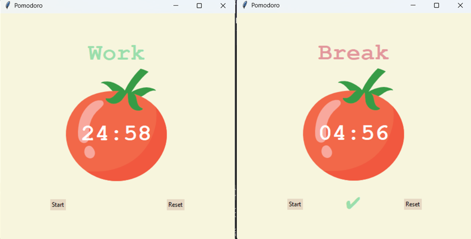

# Pomodoro Timer

A simple and elegant **Pomodoro Timer** built with **Python 3.13** using **Tkinter** and the **Canvas widget**.  
This project helps improve productivity and focus by implementing the **Pomodoro Technique**. This is defined by alternating periods of deep work and short breaks.
<div style="width:90px">  </div>
---

## 🎯 Features

- 🕒 25-minute focus sessions  
- ☕ 5-minute short breaks  
- 🌴 20 minute long break after four sessions  
- ⏱️ Visual timer built with the Tkinter Canvas widget  
- 🔄️ Reset button  
- 🎨 Clean and minimalistic interface  

---

## 🧩 How It Works

1. Start a Pomodoro (25-minute focus session).  
2. When the timer ends, take a short break (5 minutes).  
3. After four Pomodoros, take a longer break (20 minutes).  
4. Repeat to stay productive while avoiding burnout.  

---
## 🖼️ Preview

--- 

## 🛠️ Tech Stack

- **Language:** Python 3.13  
- **GUI Framework:** Tkinter  
- **Widgets Used:** Canvas, Labels, Buttons  

---

## 🚀 Getting Started

### Prerequisites
Make sure you have Python 3.13 installed on your system.

```bash
 python --version
```

---

## 🧠 Future Enhancements

- Add customizable session durations

- Include task tracking or statistics

- Add sounds and notifications when session ends

- Dark/light mode toggle

---

Made with ❤️ using Python and Tkinter.

---

## 📜 License

This project is licensed under the MIT License — feel free to use and modify it.